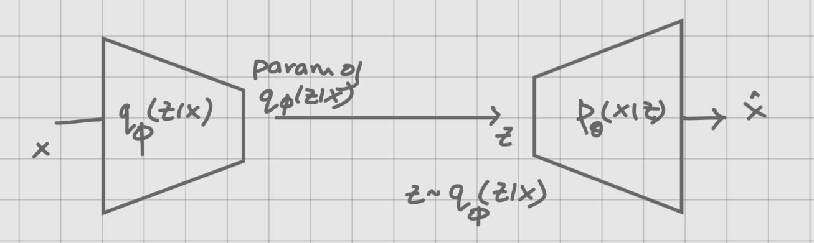

## One way to think about it

There exists a model $p_{\theta}(x) = \int p_{\theta}(x,z) dz$ 

Consider 
$$D_{KL}(q_{\phi}(z|x) \| p_{\theta}(z|x))$$

This is the KL divergence between the approximate posterior $q_{\phi}(z|x)$ and the true posterior $p_{\theta}(z|x)$.

We can expand this KL divergence:

$$ D_{KL}(q_{\phi}(z|x) \| p_{\theta}(z|x)) = \int q_{\phi}(z) \log \frac{q_{\phi}(z)}{p_{\theta}(z|x)} dz $$

$$ D_{KL}(q_{\phi}(z|x) \| p_{\theta}(z|x))= \int q_{\phi}(z) \log \frac{q_{\phi}(z)}{p_{\theta}(x,z)} p_{\theta}(x) dz $$

$$ D_{KL}(q_{\phi}(z|x) \| p_{\theta}(z|x))= \log p_{\theta}(x) + \mathbb{E}_{q_{\phi}}\left[\log \frac{q_{\phi}(z)}{p_{\theta}(x,z)}\right] $$

$$ D_{KL}(q_{\phi}(z|x) \| p_{\theta}(z|x))= \log p_{\theta}(x) + \int q_{\phi}(z) \log \frac{q_{\phi}(z)}{p_{\theta}(x)p_{\theta}(z)} dz $$

$$ D_{KL}(q_{\phi}(z|x) \| p_{\theta}(z|x))= \log p_{\theta}(x) - \mathbb{E}_{q_{\phi}}\left[\log \frac{p_{\theta}(x,z)}{q_{\phi}(z)}\right] $$

$$ D_{KL}(q_{\phi}(z|x) \| p_{\theta}(z|x))= \log p_{\theta}(x) - F_{\theta}(q_{\phi}) $$

Where $F_{\theta}(q_{\phi})$ is the evidence lower bound (ELBO) we derived earlier.

$$ F_{\theta}(q_{\phi}) = \log p_{\theta}(x) - D_{KL}(q_{\phi}(z|x) \| p_{\theta}(z|x)) $$

Recall that in the EM algorithm, we made $q_{\phi}(z|x) = p_{\theta}(z|x)$ in the E-step. And found $\theta$ by maximizing $F_{\theta}(q_{\phi})$.

However here we cannot get $q_{\phi}(z|x) = p_{\theta}(z|x)$. Hence we cannot set the KL divergence to zero, so we choose a family of distributions $q_{\phi}(z|x)$ and optimize $\phi$ to minimize the KL divergence between $q_{\phi}(z|x)$ and $p_{\theta}(z|x)$.

## Problem - Aggregated posterior mismatch

Consider the distribution called aggregated posterior defined as:

$$ q_{\phi}(z) = \int q_{\phi}(z|x) p(x) dx $$

For every $x$, we get a conditional distribution. To get the aggregated posterior, we marginalize over all $x$.

If $q_{\phi}(z|x) \neq p_{\theta}(z|x)$ for some $x$, then:

$$ q_{\phi}(z) = \int q_{\phi}(z|x) p(x) dx \neq \int p_{\theta}(z|x) p(x) dx = p_{\theta}(z) $$

This discrepancy between $q_{\phi}(z)$ and $p_{\theta}(z)$ is called the aggregated posterior mismatch.

