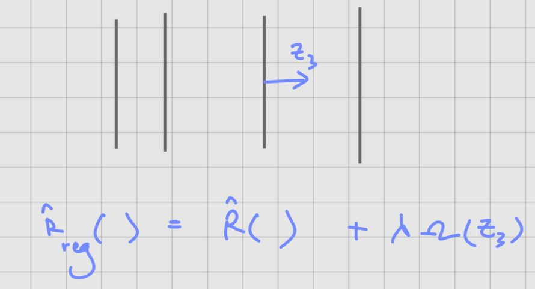

## VAE as regularized autoencoder

Reacll that:
$$ F_{\theta}(q) = \mathbb{E}_{q(z|x)} \left[ \log p_{\theta}(x|z) \right] - D_{KL} \left( q(z|x) \mid p_{\theta}(z) \right) $$

We can rewrite this as:

$$ F_{\theta}(q) = \| x - \hat{x} \|^2 - D_{KL} \left( q_{\phi}(z|x) \| p(z) \right) $$

Where: $\| x - \hat{x} \|^2$ is the reconstruction error

This formulation shows that the VAE objective can be interpreted as a regularized autoencoder.

## Recall regularization

Regular regularization was defined as:
$$ R_{reg}(\theta) = R(\theta) + \lambda \Omega(\theta) $$

Where:
- $R(\theta)$ is the empirical risk
- $\Omega(\theta)$ is the regularization term
- $\lambda$ is the regularization strength

We also know that regularized empirical risk minimization (reg ERM) is equivalent to maximum a posteriori (MAP) estimation.

$$ R_{reg}(\theta) \sim MAP$$

but the prior does not have to be on parameters $\theta$. The prior can also be on output of intermediate layer.

$$ F_{\theta}(q) = \| x - \hat{x} \|^2 - D_{KL} \left( q_{\phi}(z|x) \| p(z) \right) $$

can be seen as regularized ERM with prior on output of intermediate layer.

