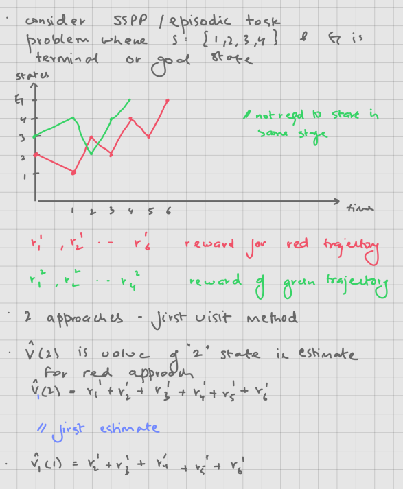

## Recap

We have covered several key topics in reinforcement learning:

- **Fundamentals and Problem Formulation**

  - Basic concepts and terminology of reinforcement learning and problem formulation

- **Multi-armed bandit problems(Single stage multiple action problems)**

  - Solved using greedy, ε-greedy, UCB, and gradient-based methods

- **Markov Decision Processes ie MDPs(Known system model (state transition probabilities and reward/cost functions))**

  1. Infinite horizon problems($n<\infty$ but deterministic) - Dynamic programming solutions to the Bellman equation for finding the optimal policy
  2. Stochastic shortest path problems($n<\infty$ but random) - Bellman equation formulations, value iteration, policy iteration
  3. Discounted cost problems ($n \to \infty$) - Bellman equation formulations, policy iteration, value iteration

## Learning the system model from data

From now on we shall assume we do not know the system model (state transition probabilities and reward/cost functions) and we need to learn it from data.
The Data is in the form of trajectories generated by the system:

$$
\underbrace{D = (s_0, a_0, r_1, s_1, a_1, r_2, s_2, \ldots, s_{t-1}, a_{t-1}, r_t, s_t)}_{\substack{\text{Trajectory showing sequence of} \\ \text{states, actions and rewards} \\ \text{leading to terminal state } s_t}}
$$

where:

- $s_i$ represents the state at time step $i$
- $a_i$ represents the action taken at time step $i$
- $r_{i+1}$ represents the reward received when transitioning from state $s_i$ to $s_{i+1}$
- $s_t$ is the terminal state

## Monte Carlo Methods

Monte Carlo methods are one of the first classes of algorithms that work with sampled trajectories rather than requiring a complete model of the environment. They are based on averaging sample returns from complete episodes.

### Key Idea

For a policy $\mu$, recall that the value function is defined as:

$$
\underbrace{J^\mu(i)}_{\substack{\text{Value function} \\ \text{for state i}}} = \underbrace{E_\mu \left[ \sum_{k=1}^T r_{k+1} \mid s_0 = i \right]}_{\substack{\text{Expected sum of rewards} \\ \text{starting from state i}}}
$$

where:

- $r_{k+1}$ is the reward received after taking action $a_k$ in state $s_k$
- The expectation $E_\mu$ is taken with respect to the policy $\mu$
- $T$ is the time horizon (episode length)

Although we cannot compute this expectation directly (which would require knowing transition probabilities), we can estimate it from data.
We can run the simulation many times to get many trajectories and then calculate the $J^\mu(i)$ for each state $i$ as the average of the returns observed in that state.
There are 2 methods to do this:

### First visit method

In the first-visit Monte Carlo method, we estimate $J^\mu(i)$ by averaging the returns following only the first visit to state $i$ in each episode. The return, denoted as $G_k(i)$, is the total sum of rewards obtained from the first visit to state $i$ until the end of the episode $k$. This represents the actual accumulated reward that was received, rather than an expected value.

$$
\underbrace{J^\mu(i)}_{\substack{\text{Estimated value} \\ \text{for state i}}} \approx \underbrace{\frac{1}{N_i} \sum_{k=1}^{N_i} G_k(i)}_{\substack{\text{Average of returns from} \\ \text{first visits to state i}}}
$$

where:

- $N_i$ is the number of episodes in which state $i$ was visited at least once
- $G_k(i)$ is the return (sum of rewards) following the first visit to state $i$ in episode $k$, calculated as:

$$
\underbrace{G_k(i)}_{\substack{\text{Return from} \\ \text{state i in episode k}}} = \underbrace{\sum_{t=t_i}^T r_{t+1}}_{\substack{\text{Sum of rewards from first} \\ \text{visit to i until episode end}}}
$$

  where $t_i$ is the time of first visit to state $i$

The algorithm:

1. Initialize:

   - Empty array $Returns(s)$ for each state $s$ to store observed returns
   - Value function $J(s)$ arbitrarily for each state $s$ as initial estimates

2. For each episode:
   - Generate an episode following policy $\mu$: $(s_0,a_0,r_1,s_1,\ldots,s_T)$
   - $G \leftarrow 0$ (initialize return accumulator)
   - For each step $t=T-1,T-2,\ldots,0$ (backward iteration):
     - $G \leftarrow G + r_{t+1}$ (accumulate rewards to get return)
     - If $s_t$ not appeared in $s_0,s_1,\ldots,s_{t-1}$ (first visit check):
       - Append $G$ to $Returns(s_t)$ (store return for this first visit)
       - $J(s_t) \leftarrow average(Returns(s_t))$ (update state value estimate)

### Every visit method

Unlike the first visit method, if a state is visited multiple times in a single trajectory, we include all the returns from those visits in the average. This can lead to faster learning since we use more data points, but may also introduce more correlation between samples.

### Incremental mean

When implementing Monte Carlo methods, rather than storing all returns and recalculating the mean each time, we can use an incremental update rule. This is more computationally efficient, especially for long-running systems.

The incremental mean formula allows us to update our value estimates after each new return without storing the entire history:

$$
\underbrace{V_{n+1}(s)}_{\substack{\text{New value estimate} \\ \text{after n+1 samples}}} = \underbrace{V_n(s)}_{\substack{\text{Current estimate} \\ \text{after n samples}}} + \underbrace{\frac{1}{n+1}}_{\substack{\text{Learning rate} \\ \text{for n+1 samples}}} \underbrace{(G_{n+1} - V_n(s))}_{\substack{\text{Difference between} \\ \text{new return and current estimate}}}
$$

This can be derived from the standard mean formula:

$$
\begin{align*}
V_{n+1}(s) &= \frac{1}{n+1} \sum_{m=1}^{n+1} G_m \\
&= \frac{1}{n+1} \left(\sum_{m=1}^n G_m + G_{n+1}\right) \\
&= \frac{1}{n+1} \left(nV_n(s) + G_{n+1}\right) \\
&= \frac{n}{n+1} V_n(s) + \frac{1}{n+1} G_{n+1} \\
&= V_n(s) + \frac{1}{n+1}(G_{n+1} - V_n(s))
\end{align*}
$$

This incremental form:

- Requires only the current estimate $V_n(s)$
- The sample count $n$
- The new return $G_{n+1}$
- Uses constant memory regardless of the number of episodes
- Is numerically more stable for large numbers of episodes

### General Form with Step Size

More generally, we can use a step size parameter $\alpha_n$ to control the learning rate:

$$
\underbrace{V_{n+1}(s)}_{\substack{\text{Updated value} \\ \text{estimate}}} = \underbrace{V_n(s)}_{\substack{\text{Current value} \\ \text{estimate}}} + \underbrace{\alpha_n}_{\substack{\text{Step size at} \\ \text{iteration n}}} \underbrace{(G_{n+1} - V_n(s))}_{\substack{\text{Prediction error} \\ \text{or TD error}}}
$$

where $\alpha_n > 0$ are step sizes or learning rates that satisfy the Robbins-Monro conditions:

$$
\underbrace{\sum_{n=1}^{\infty} \alpha_n = \infty}_{\substack{\text{Steps are large enough} \\ \text{to overcome initial conditions}}} \quad \text{and} \quad \underbrace{\sum_{n=1}^{\infty} \alpha_n^2 < \infty}_{\substack{\text{Steps become small enough} \\ \text{to ensure convergence}}}
$$

Under these conditions, one can show that as $n \to \infty$:

$$
\underbrace{V_n(s)}_{\substack{\text{Value estimate} \\ \text{after n iterations}}} \to \underbrace{E[G_{n+1}|s_t = s]}_{\substack{\text{Expected return} \\ \text{from state s}}} = \underbrace{J^{\mu}(s)}_{\substack{\text{True value function} \\ \text{for policy } \mu}}
$$

This convergence result is crucial as it guarantees that our value estimates will eventually converge to the true value function of the policy being evaluated.

### Online Version of the Algorithm

The online version of this algorithm updates only the state visited at time n, using an indicator function:

$$
\underbrace{V_{n+1}(s_n)}_{\substack{\text{Updated value for} \\ \text{visited state } s_n}} = \underbrace{V_n(s_n)}_{\substack{\text{Current value for} \\ \text{visited state } s_n}} + \underbrace{\alpha_n}_{\substack{\text{Step size at} \\ \text{iteration n}}} \underbrace{(G_n - V_n(s_n))}_{\substack{\text{Prediction error for} \\ \text{visited state } s_n}}
$$

with the constraint that values for all other states remain unchanged:

$$
\underbrace{V_{n+1}(s) = V_n(s)}_{\substack{\text{No update for} \\ \text{non-visited states}}} \quad \forall s \neq s_n
$$

This can be written more compactly using an indicator function:

$$
\underbrace{V_{n+1}(s)}_{\substack{\text{Updated value} \\ \text{for any state}}} = \underbrace{V_n(s)}_{\substack{\text{Current value} \\ \text{for any state}}} + \underbrace{\alpha_n}_{\substack{\text{Step size at} \\ \text{iteration n}}} \underbrace{I_{\{s=s_n\}}}_{\substack{\text{Indicator function:} \\ \text{1 if } s=s_n \text{, 0 otherwise}}} \underbrace{(G_{n+1} - V_n(s))}_{\substack{\text{Prediction error} \\ \text{term}}}
$$

where the indicator function $I_{\{s=s_n\}}$ is defined as:

$$
\underbrace{I_{\{s=s_n\}}}_{\substack{\text{Indicator function for} \\ \text{state matching}}} = \begin{cases} 
1 & \text{if } s = s_n \\
0 & \text{otherwise}
\end{cases}
$$

This online formulation:

- Updates only the value of the currently visited state
- Maintains computational efficiency
- Preserves the convergence properties of the original algorithm
- Is more suitable for real-time learning scenarios

## Temporal Difference Learning

Temporal Difference (TD) learning is a fundamental reinforcement learning method that combines ideas from Monte Carlo methods and dynamic programming. Let's examine how TD learning works by looking at it from different perspectives.

### Alternative View of TD Learning

Recall that:

$$
\underbrace{V_{n+1}(s)}_{\substack{\text{Updated value} \\ \text{for any state}}} = \underbrace{V_n(s)}_{\substack{\text{Current value} \\ \text{for any state}}} + \underbrace{\alpha_n}_{\substack{\text{Step size at} \\ \text{iteration n}}} \underbrace{I_{\{s=s_n\}}}_{\substack{\text{Indicator function:} \\ \text{1 if } s=s_n \text{, 0 otherwise}}} \underbrace{(G_{n+1} - V_n(s))}_{\substack{\text{Prediction error} \\ \text{term}}}
$$

We can expand this further to show how TD learning bootstraps from subsequent value estimates:

$$
\begin{align*}
\underbrace{V_{n+1}(s_n)}_{\substack{\text{Updated value} \\ \text{at state } s_n}} &= \underbrace{V_n(s_n)}_{\substack{\text{Current value} \\ \text{at state } s_n}} + \underbrace{\alpha_n}_{\substack{\text{Step size at} \\ \text{iteration n}}} (\underbrace{R_{n+1} + V_n(s_{n+1}) - V_n(s_n)}_{\substack{\text{TD error using bootstrap} \\ \text{from next state value}}}) \\
&= V_n(s_n) + \alpha_n(R_{n+1} + \underbrace{V_n(s_{n+1})}_{\substack{\text{Bootstrap estimate} \\ \text{of future value}}} - V_n(s_n)) \\
&= V_n(s_n) + \alpha_n(R_{n+1} + \underbrace{V_n(s_{n+1}) - V_n(s_{n+1})}_{\substack{\text{Zero sum term added} \\ \text{for expansion}}} + V_n(s_{n+1}) - V_n(s_n)) \\
&= V_n(s_n) + \alpha_n(R_{n+1} + \underbrace{V_n(s_{n+2}) - V_n(s_{n+1})}_{\substack{\text{TD error at} \\ \text{next state}}} + V_n(s_{n+1}) - V_n(s_n)) \\
&= V_n(s_n) + \alpha_n(R_{n+1} + \underbrace{V_n(s_{n+3}) - V_n(s_{n+2})}_{\substack{\text{TD error at} \\ \text{state n+2}}} + V_n(s_{n+2}) - V_n(s_{n+1}) + V_n(s_{n+1}) - V_n(s_n)) \\
&\vdots \\
&= V_n(s_n) + \alpha_n(R_{n+1} + R_{n+2} + \cdots + R_N + \underbrace{V_n(s_N) - V_n(s_N)}_{\substack{\text{Terminal state} \\ \text{value difference}}} + V_n(s_N) - V_n(s_{n+N-1}) + \cdots + V_n(s_{n+1}) - V_n(s_n))
\end{align*}
$$

Let's denote the temporal differences at each step as:

$$
\begin{align*}
\underbrace{d_n}_{\substack{\text{TD at} \\ \text{step n}}} &= \underbrace{R_n + V_n(s_{n+1}) - V_n(s_n)}_{\substack{\text{Reward plus discounted next value} \\ \text{minus current value}}} \\
\underbrace{d_{n+1}}_{\substack{\text{TD at} \\ \text{step n+1}}} &= \underbrace{R_{n+1} + V_n(s_{n+2}) - V_n(s_{n+1})}_{\substack{\text{Reward plus discounted next value} \\ \text{minus current value}}} \\
&\vdots \\
\underbrace{d_N}_{\substack{\text{TD at} \\ \text{terminal step}}} &= \underbrace{R_N + V_n(s_N) - V_n(s_{N-1})}_{\substack{\text{Final reward plus terminal value} \\ \text{minus previous value}}}
\end{align*}
$$

These quantities $d_n, d_{n+1}, \ldots, d_N$ are referred to as temporal differences since they represent the difference between temporally successive predictions. Each temporal difference captures the local prediction error at that time step.

Using these temporal differences, we can write the TD learning algorithm in two equivalent forms:

### Forward View TD Learning

The forward view updates the value function by considering all future temporal differences:

$$
\underbrace{V_{n+1}(s_n)}_{\substack{\text{Updated value} \\ \text{at state } s_n}} = \underbrace{V_n(s_n)}_{\substack{\text{Current value} \\ \text{at state } s_n}} + \underbrace{\alpha}_{\substack{\text{Learning} \\ \text{rate}}} \underbrace{(d_n + d_{n+1} + \cdots + d_{N-1})}_{\substack{\text{Sum of all future} \\ \text{temporal differences}}}
$$

### Backward View TD Learning

The backward view provides an alternative, more computationally efficient update rule:

$$
\underbrace{V_{n+k+1}(s_n)}_{\substack{\text{Updated value} \\ \text{at state } s_n}} = \underbrace{V_{n+k}(s_n)}_{\substack{\text{Current value} \\ \text{at state } s_n}} + \underbrace{\alpha}_{\substack{\text{Learning} \\ \text{rate}}} \underbrace{d_{n+k}}_{\substack{\text{Single temporal} \\ \text{difference}}}, \quad k = 0,1,\ldots,N-n
$$

This backward view makes updates incrementally as temporal differences are observed, making it more suitable for online learning scenarios where we want to update values as soon as we get samples of temporal differences.
